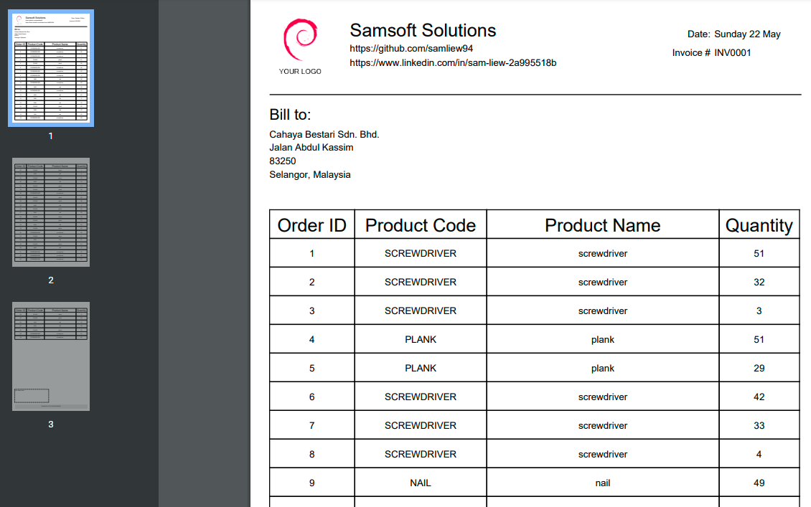

# SpringJasperDemo
A web app that demonstrates how to use Spring Boot in conjunction with Jasper Reports for printing

# Context
  User wants to print order details stored in a database. 
  So I setup an api endpoint at server:port/print that fetches all the records from table "Orders". 
  After fetch, all objects are then stored in a List<Map> then converted to a Json file. 
  This Json file is then sent to the .jasper file to display records ready for printing. 

# Setup
  Your machine must be running Java 11 (may add Docker support) 
  The app runs on localhost:8080 
  In command prompt, run the following:   
  `java -jar SpringJasperDemo-1.0.0.jar` 
  Navigate to any of the end points below to test it out. 

# End Points
  `/order` -> fetches all orders from db 
  `/order/delete` -> deletes all data from table Order 
  `/order/populate` -> performs /order/delete, inserts 50 rows of of random data and finally performs /order 
  `/print` -> all data from table Order is processed and prepped by JasperLibrary for printing. 

# DB Structure:
  DB Type -> MySQL 
  Tables -> Orders and Products 
  Orders -> id, ordered_date, product (fkey to Products), quantity 
  Products -> id, product_code, product_name 
  
  
